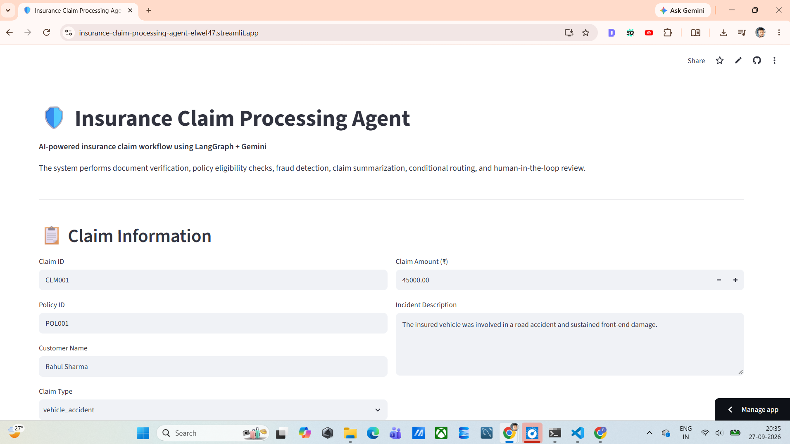
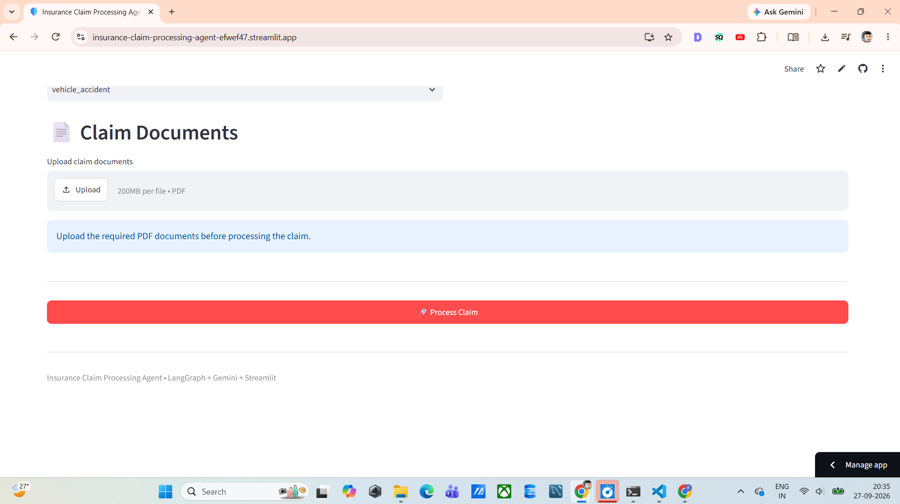
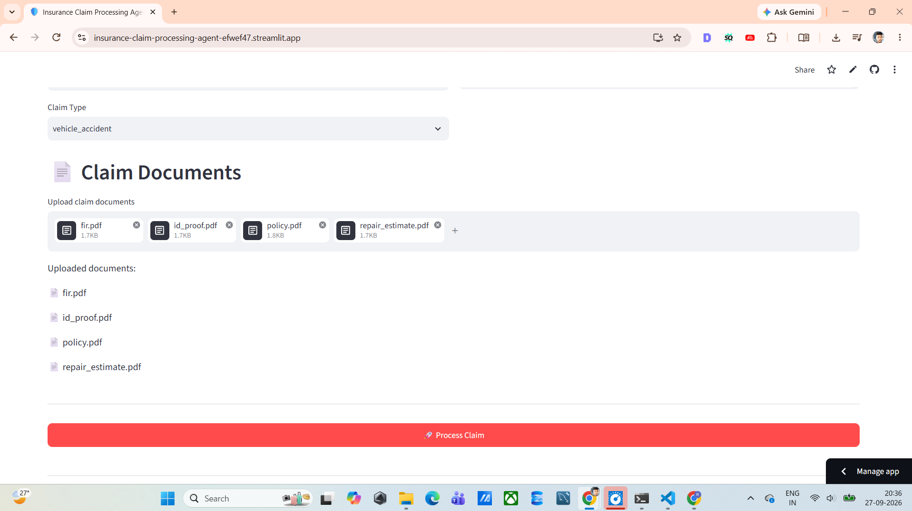
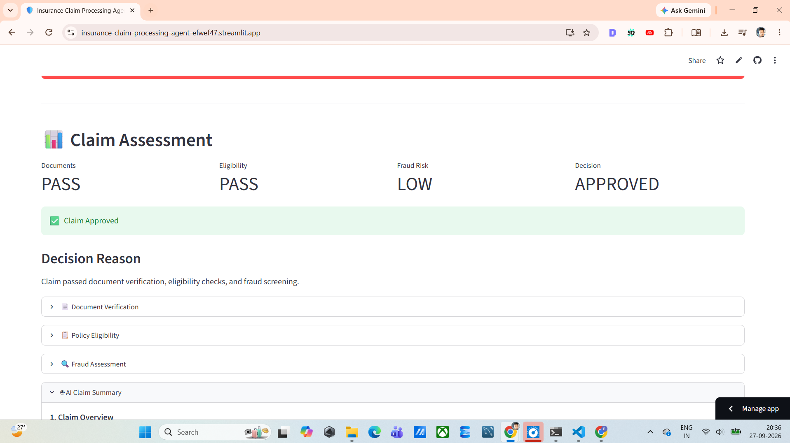
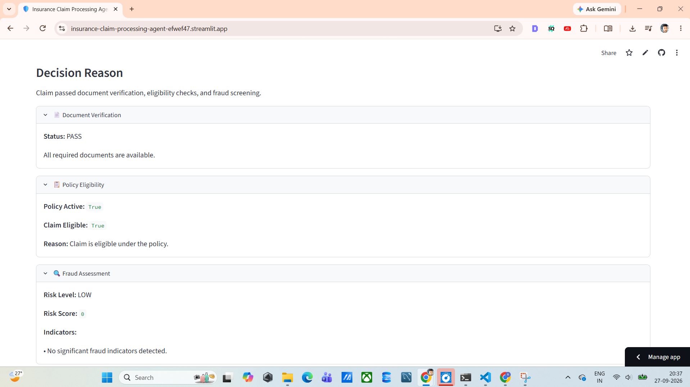
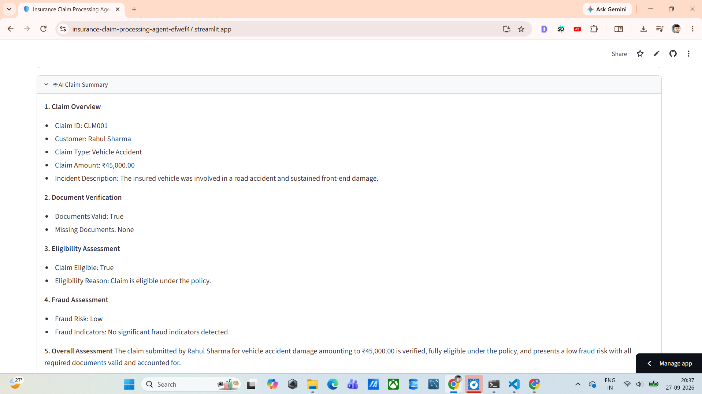

# 🛡️ Insurance Claim Processing Agent

> An AI-powered insurance claim processing system built with **LangGraph, Gemini, Python, and Streamlit** to automate document verification, policy eligibility assessment, fraud-risk analysis, claim summarization, conditional routing, and human-in-the-loop review.

---

## 🚀 Live Demo

### 🌐 Try the Application

👉 **[Open Insurance Claim Processing Agent](https://insurance-claim-processing-agent-efwef47.streamlit.app/)**

The application provides an interactive Streamlit interface where users can enter claim information, upload supporting documents, and run an end-to-end AI-powered claim assessment workflow.

---

## 📌 Project Overview

Insurance claim processing often involves multiple manual steps such as:

- Collecting claim information
- Checking required documentation
- Verifying policy eligibility
- Assessing potential fraud indicators
- Reviewing claim details
- Preparing a claim summary
- Routing complex cases for human review
- Making a final processing decision

This project demonstrates how an **AI Agent workflow** can orchestrate these tasks using **LangGraph** and **Google Gemini**.

The system processes a claim through multiple specialized stages and maintains the state of the claim throughout the workflow.

Claim Assessment Report
# 🖥️ Application Screenshots

The following screenshots demonstrate the complete end-to-end workflow of the deployed **Insurance Claim Processing Agent**.

---

## 1. Claim Information

Users can enter the claim details including Claim ID, Policy ID, customer information, claim amount, claim type, and incident description.

  

---

## 2. Claim Document Upload

Users can upload the required supporting insurance documents in PDF format before processing the claim.

  

---

## 3. Uploaded Claim Documents

The application displays the uploaded documents and allows the user to verify that all required files are available before starting the claim-processing workflow.

  

---

## 4. Claim Assessment Dashboard

After processing, the application displays the overall assessment, including document verification, policy eligibility, fraud risk, and the final claim decision.

  

---

## 5. Decision Reasoning

The application provides expandable sections containing the detailed results of document verification, policy eligibility, and fraud assessment.

  

---

## 6. AI Claim Summary

The AI-generated claim summary consolidates the claim information, document verification, eligibility assessment, fraud assessment, and overall assessment into a structured report.

  

---

# 🎯 Problem Statement

Insurance claim processing can involve multiple repetitive verification activities before a claim can be assessed.

A typical workflow may require checking:

- Whether all required documents have been submitted
- Whether the policy is active
- Whether the claim type is covered
- Whether the claim amount is within the policy limit
- Whether potential fraud indicators exist
- Whether the claim requires additional human review
- How the final claim information should be summarized

When these activities are performed manually, the process can become time-consuming and difficult to standardize.

This project demonstrates an automated workflow that brings these processing stages together into a single application.

Agent Architecture
Component	Responsibility
| Component                   | Responsibility                                   |
| --------------------------- | ------------------------------------------------ |
| 📄 **Document Agent**       | Validates required claim documents               |
| 📋 **Eligibility Agent**    | Checks policy and claim eligibility              |
| 🚨 **Fraud Agent**          | Performs configurable fraud-risk assessment      |
| 🧠 **Summary Agent**        | Generates AI-powered claim summary               |
| 👤 **Human Approval Agent** | Handles human review and approval/rejection      |
| 🔀 **Routing Logic**        | Controls conditional workflow transitions        |
| 🗂️ **Claim State**         | Maintains workflow data across processing stages |

🛠️ Technology Stack
| Technology                       | Purpose                               |
| -------------------------------- | ------------------------------------- |
| 🐍 **Python**                    | Core programming language             |
| 🔗 **LangGraph**                 | Stateful workflow orchestration       |
| 🦜 **LangChain**                 | LLM application framework             |
| 🧠 **Google Gemini**             | Generative AI and claim summarization |
| 🖥️ **Streamlit**                | Interactive web application           |
| 📄 **PyMuPDF**                   | PDF processing                        |
| ✅ **Pydantic**                   | Data validation and structured state  |
| 📦 **JSON**                      | Policy, claim, and test data          |
| 🧪 **Python Testing**            | Component and workflow testing        |
| 🌐 **Git / GitHub**              | Version control and source hosting    |
| ☁️ **Streamlit Community Cloud** | Deployment                            |

## 📸 Complete Application Preview

### Claim Submission → Document Processing → AI Assessment → Final Decision

  
  

  
  

  
  

                ┌──────────────────────┐
                │   Claim Submission   │
                └──────────┬───────────┘
                           │
                           ▼
                ┌──────────────────────┐
                │ Document Verification│
                └──────────┬───────────┘
                           │
                           ▼
                ┌──────────────────────┐
                │ Policy Eligibility   │
                └──────────┬───────────┘
                           │
                           ▼
                ┌──────────────────────┐
                │   Fraud Assessment  │
                └──────────┬───────────┘
                           │
                  ┌────────┴────────┐
                  │                 │
                  ▼                 ▼
          ┌──────────────┐   ┌────────────────┐
          │ AI Summary   │   │ Human Review   │
          └──────┬───────┘   └───────┬────────┘
                 │                   │
                 └─────────┬─────────┘
                           ▼
                ┌──────────────────────┐
                │   Final Assessment   │
                └──────────────────────┘
Testing covers areas such as:

Document validation

Missing document detection

Policy validation

Policy status

Claim amount validation

Fraud-risk assessment

Gemini API connectivity

AI summarization

Workflow execution

Human review

Human approval

Workflow resumption

                        ┌─────────────────┐
                        │    Streamlit    │
                        │   User Interface│
                        └────────┬────────┘
                                 │
                                 ▼
                       ┌──────────────────┐
                       │  Claim State     │
                       │   Management     │
                       └────────┬─────────┘
                                │
                                ▼
                       ┌──────────────────┐
                       │    LangGraph     │
                       │ Workflow Engine  │
                       └────────┬─────────┘
                                │
             ┌──────────────────┼──────────────────┐
             │                  │                  │
             ▼                  ▼                  ▼
      ┌─────────────┐    ┌─────────────┐    ┌─────────────┐
      │  Document   │    │ Eligibility │    │    Fraud    │
      │    Agent    │    │    Agent    │    │    Agent    │
      └──────┬──────┘    └──────┬──────┘    └──────┬──────┘
             │                  │                  │
             └──────────────────┼──────────────────┘
                                │
                                ▼
                       ┌──────────────────┐
                       │ Conditional      │
                       │ Routing / HITL   │
                       └────────┬─────────┘
                                │
                                ▼
                       ┌──────────────────┐
                       │ Gemini AI        │
                       │ Claim Summary    │
                       └────────┬─────────┘
                                │
                                ▼
                       ┌──────────────────┐
                       │ Final Assessment │
                       └──────────────────┘
